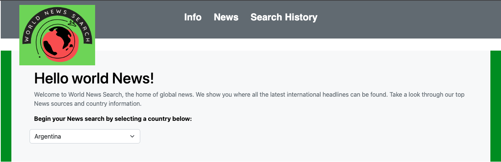
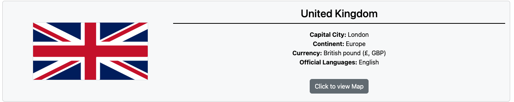
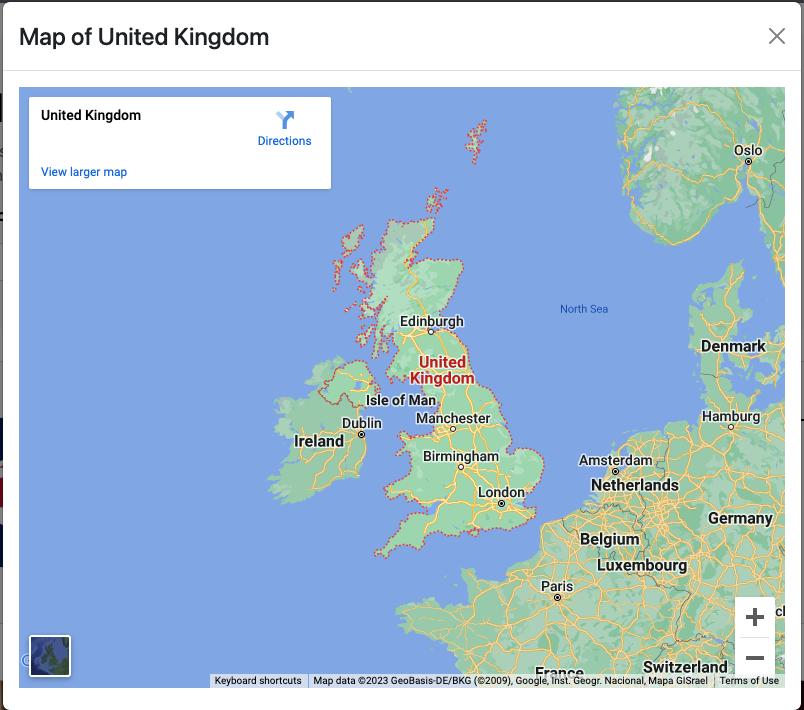
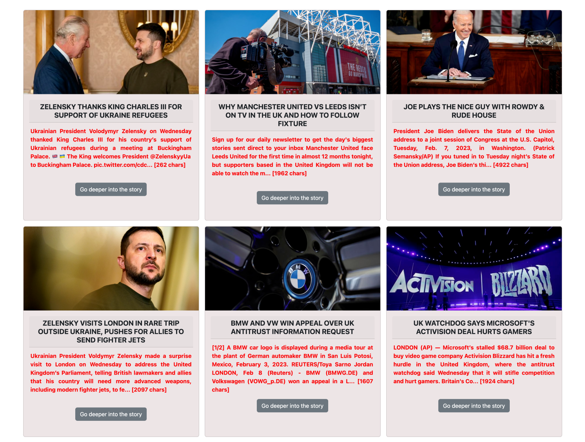
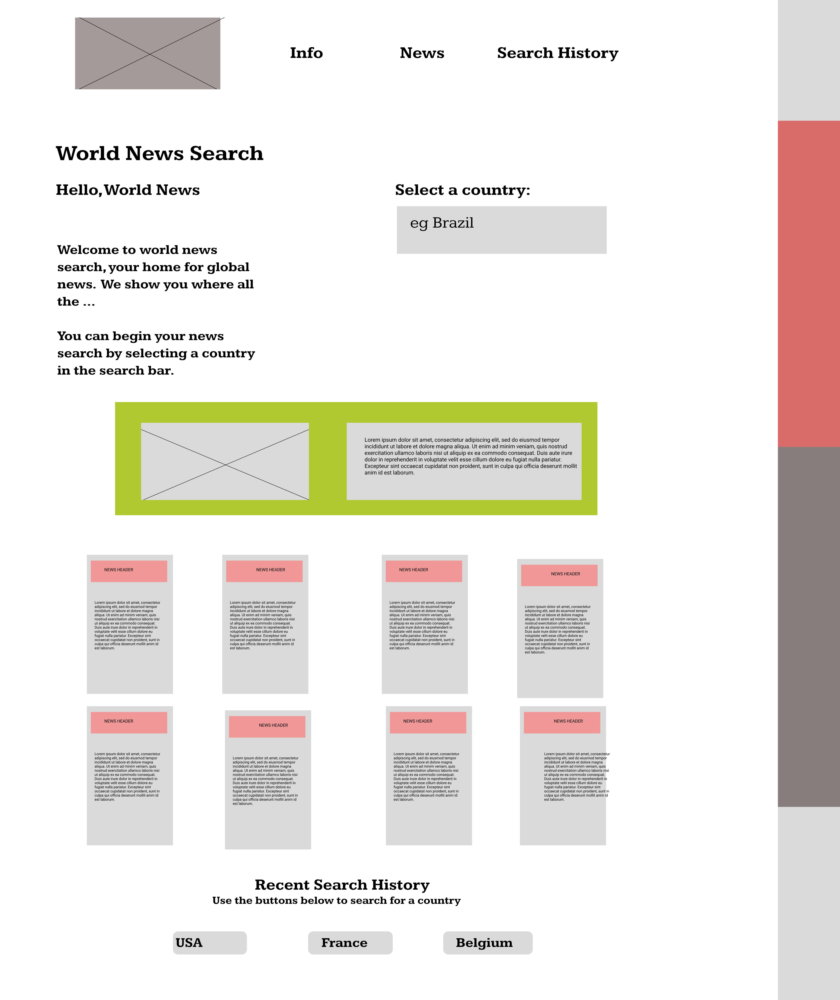
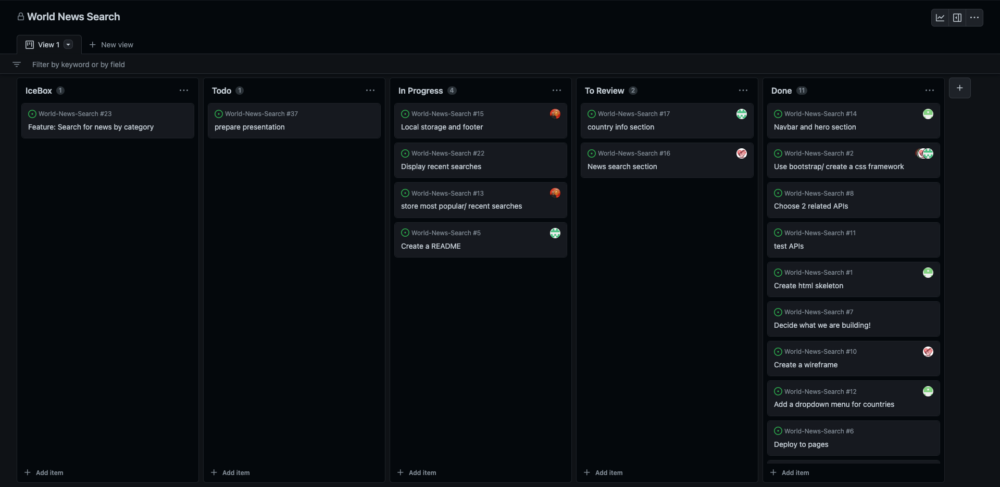

# World News Search

## Overview
This application is a news aggregator, allowing users to find various news about a country of their choice. This application will provide the user with various recent news articles about their selected country, accompanied with some information about that country, such as their flag, capital city and more.
This also saves the users previous searches and allows the user quick access to re-search for news about these countries.

This application was created using:
* HTML
* CSS
* JavaScript
* Bootstrap v5.2
* Server-side APIs

This application runs with the use of two server-side APIs to retrieve various data. These APIs are:
* RESTcountries API
* GNews API

## Description
This web application starts with a nav bar and hero section providing an explanation of the application. The nav bar allows users to have seamless transitions between the various sections within this webpage. In the hero section, a dropdown menu available to allow users to select their chosen country. This dropdown list includes a vast number of countries and allows users to type initial characters of their search for faster accessibility. 

Following this, a section about the country selected is generated using the RESTcountries API. By gathering and displaying the data provided by this API we are able to show the capital city, continent, the currency (including abbreviation and symbol) and a list of the official national spoken languages. Also included is a button to access a google map of the country, using a bootstrap modal to provide a better experience.

The next section provides the various news articles generated from the GNews API with a search parameter of the country's name. These news articles are displayed as bootstrap cards and they include the main image of the article, the title of the article, a description of the content of the article and also provides a button to open the article on another tab.

At the bottom of the application, a search history is recorded. Allowing the user to see a record of their previous searches which are saved on their local storage, and provide fast access to re-search that country and generate news articles about it.

#### Application Screenshot: - Full Screenshot before call

#### Application Screenshot: - Full Screenshot After call

#### Nav Bar and Hero Section:

#### Country Information Section:

#### Modal for Map of Country:

#### News Section:

#### Saved Search Section:

## Credits
Use of RESTcountries API - https://restcountries.com/  
Use of GNews API - https://gnews.io/ 

## Collaborators
This project was built by:
* [Shaiza Iqbal](https://github.com/shaizai1)
* [Zee Mudia](https://github.com/iosazee)
* [Mike Davies](https://github.com/welsh-bloke)
* [Alex Ainslie](https://github.com/AlexAins)

We worked together to produce this application by splitting the work between all of us and working together to merge our work into a single working application. To keep a clear idea of our work we created a wireframe for our application and a Kanban Board to track our work on GitHub.

#### Application Wireframe:

#### Kanban Board:

## Deployed Application
Link to deployed application: https://shaizai1.github.io/World-News-Search/ 
